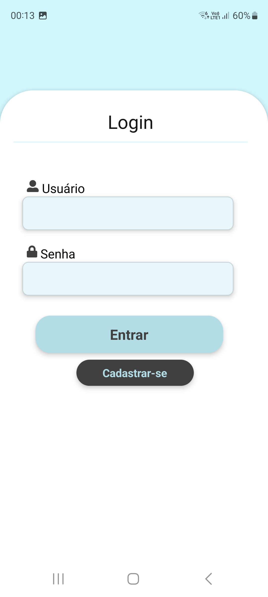
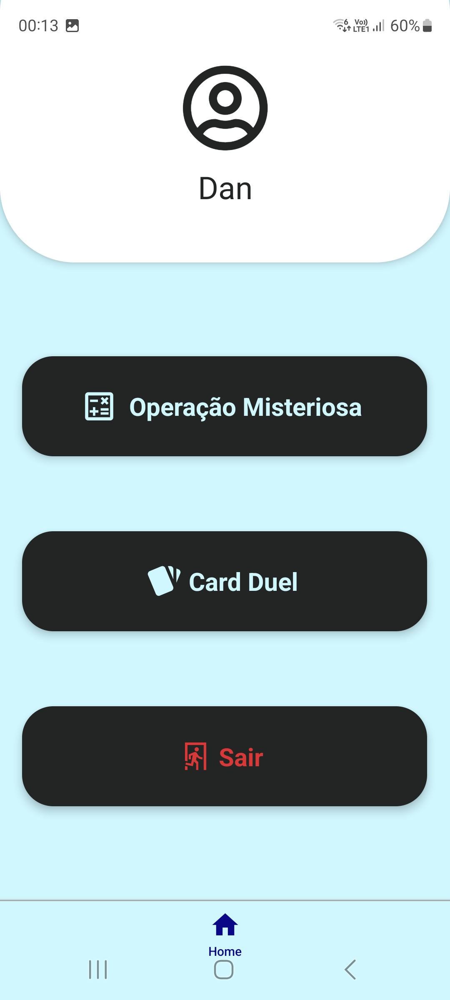
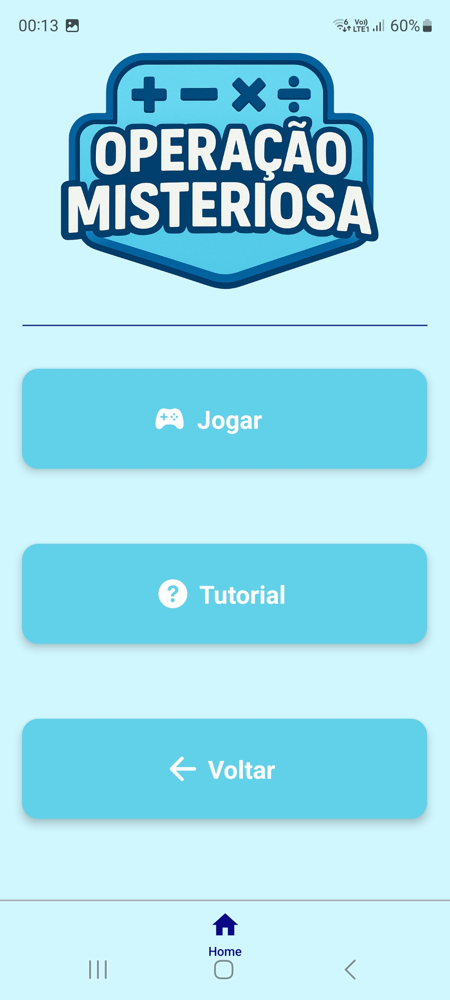
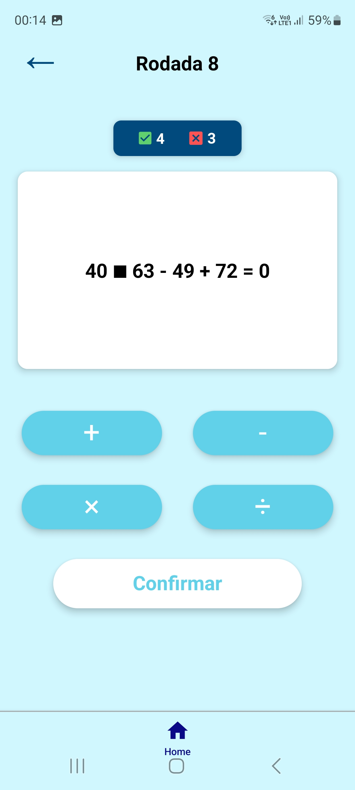
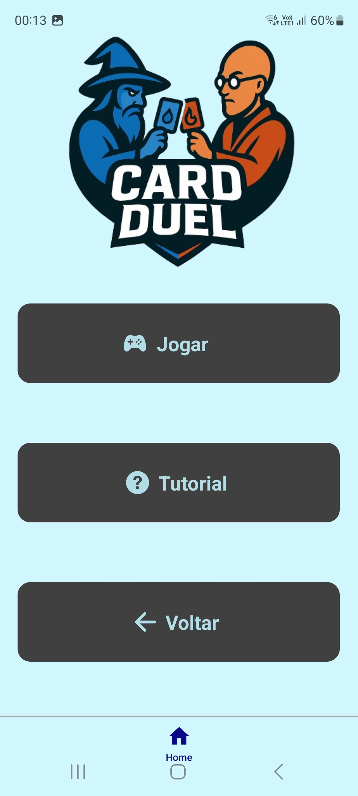
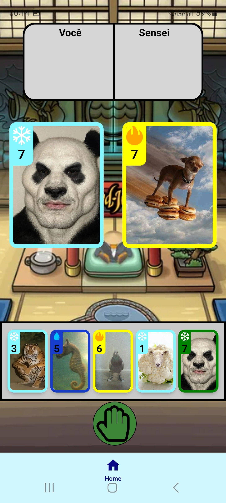

# Projeto React Native - Disciplina CCP150

## Sumário
- [Objetivo do Projeto](#objetivo-do-projeto)
- [Tecnologias Utilizadas](#️tecnologias-utilizadas)
- [Estrutura do Sistema](#estrutura-do-sistema)
- [Funcionalidades Principais](#funcionalidades-principais)
  - [1. Cadastro de Usuário](#1-cadastro-de-usuário)
  - [2. Login de Usuário](#2-login-de-usuário)
  - [3. Home](#3-home)
  - [4. Menu do Jogo 1 - Operação Misteriosa](#4-menu-do-jogo-1--operação-misteriosa)
  - [5. Menu do Jogo 2 - Card Duel](#5-menu-do-jogo-2--card-duel)
  - [6. Operação Misteriosa](#6-operação-misteriosa)
  - [7. Card Duel](#7-card-duel)
- [Motivação](#motivação)
- [Algumas Telas](#algumas-telas)

## Objetivo do Projeto
Inspirado em jogos mobiles, este app busca proporcionar uma experiência positiva através da criação de 2 jogos casuais e interativos em um único ambiente + um sistema de contas, permitindo cadastro e login de um usuário.

## Tecnologias Utilizadas
* **React Native** - framework principal para desenvolvimento mobile
* **Expo Snack** - ambiente online usado durante o desenvolvimento e testes rápidos do projeto.  
* **Expo** - para facilitar o processo de execução e build
* **React Navigation** - responsável pela navegação entre telas
* **AsyncStorage** - armazenamento local dos dados do usuário
* **StyleSheet** - estilização de componentes

## Estrutura do Sistema

```plaintext
Projeto-React-Native-main
├── 📂 assets/      # Contém imagens, ícones e áudios utilizados no app
├── 📂 navs/        # Responsável pela navegação entre as telas
├── 📂 screenshots/ # Contém as imagens do aplicativo (p/ readme)
├── 📂 telas/       # Onde está localizado todos arquivos de telas do app (.js)
├── 📜 App.js       # Ponto de entrada principal do aplicativo
├── 📜 index.js     # Arquivo inicial que registra o App principal
├── 📜 app.json     # Configurações do aplicativo (nome, versão, ícone, etc.)
├── 📜 package.json # Gerencia dependências, scripts e metadados do projeto
├── 📜 .gitignore
└── 📜 README.md
```

## Funcionalidades Principais 

### 1. Cadastro de Usuário
Permite que o usuário crie uma conta informando **nome de usuário** e **senha**. Os dados são validados e se estiverem corretos, a conta é salva no banco de dados local, permitindo o login.

Observação: Não é possível 2 usuários (ou mais) terem o mesmo nome.

### 2. Login de Usuário
O usuário, após criar sua conta, é capaz de acessar o app efetuando o login. São necessários o **username** e **senha**. Após digitar, o sistema valida os dados digitados, e se estiverem corretos, o usuário é autenticado e redirecionado para a home, permitindo acesso às funcionalidades privadas.

Importante: Após o login, o sistema trabalha apenas com o nome do usuário, já que não existe nenhuma pontuação ou ranking nos jogos (por se tratar de jogos casuais).

### 3. Home
Após o usuário logar em sua conta, ele é redirecionado para a tela inicial (Home), onde são exibidos seu nome e foto de perfil (está genérica).

A tela contém 3 botões: 
-  **Operação Misteriosa** — leva ao menu do primeiro jogo  
-  **Card Duel** — leva ao menu do segundo jogo 
-  **Sair** — permite que o usuário deslogue de sua conta e volte à tela de login

### 4. Menu do Jogo 1 — *Operação Misteriosa*  
Nesta tela, o usuário encontra três botões principais:

- **Jogar** — redireciona para a tela de gameplay, onde o usuário pode jogar *Operação Misteriosa*  
- **Tutorial** — leva para a tela que exibe as instruções e regras do jogo  
- **Voltar** — retorna ao menu principal (Home)

### 5. Menu do Jogo 2 — *Card Duel*  
Nesta tela, o usuário encontra três botões principais:

- **Jogar** — redireciona para a tela de gameplay, onde o usuário pode jogar *Card Duel*  
- **Tutorial** — leva para a tela que exibe as instruções e regras do jogo  
- **Voltar** — retorna ao menu principal (Home)

### 6. Operação Misteriosa  

   * ### 6.1 **Como funciona?**  
   *Operação Misteriosa* é um jogo de matemática em que o usuário deve adivinhar qual operação (`+`, `-`, `*` ou `/`) está faltando na expressão exibida na tela.  
   
   * O jogo possui **10 rodadas**.  
   * A operação ausente aparece representada por um **quadrado (□)**.  
   * O jogador escolhe a operação correta por meio de **quatro botões interativos**.  
   * O objetivo é **acertar pelo menos 6 questões** para vencer.  
   * A cada rodada, as expressões se tornam **mais difíceis**.  
   
   O jogo estimula o raciocínio e a prática de operações básicas de forma desafiadora.
   
   * ### 6.2 **Como foi desenvolvido?**
     Resumo passo a passo:
   
       **1. Sorteio da operação:** um número aleatório de `1` a `4` é sorteado; cada número mapeia para uma operação (`+`, `-`, `*`, `/`).
   
       **2. Definição da dificuldade:** o sistema verifica a rodada atual (1 a 10) para ajustar o grau de dificuldade da expressão (ex.: amplitude dos números, presença de parênteses, operações compostas).
   
       **3. Geração da expressão aleatória**: a expressão é construída aleatoriamente (números e operações visíveis). Em determinadas rodadas pode ocorrer um **bônus:**
   
        * O resultado é reescrito por uma expressão equivalente mais simples.
        * A expressão pode incluir **parênteses** para aumentar a complexidade.
      
     **4. Preparação da resposta correta:** após gerar a expressão, o sistema calcula internamente a resposta correta faltante e guarda a expressão (inteira, por exemplo "3 + 6 - 5 = 4") quanto a resposta (operação) em strings.
   
     **5. Interação do usuário:** o usuário seleciona uma das quatro operações através de botões e confirma a escolha.
   
     **6. Validação e pontuação:** o sistema compara a escolha do usuário com a resposta correta; se coincidir, adiciona **+1 ponto** ao placar.   
   
     **7. Finalização e feedback:** 
   
     * Após as 10 rodadas, o sistema verifica se o jogador acertou **pelo menos 6** questões.  
     * Exibe uma imagem indicando aprovação/reprovação e um botão para **Jogar Novamente**.  
     * O botão **Voltar** permanece fixo no canto superior esquerdo, retornando à Home.

### 7. Card Duel

   * ### 7.1 **Como funciona?**
     Inspirado no clássico jogo de cartas do *Club Penguin*, **Card Jitsu**, o *Card Duel* é um jogo de estratégia onde o usuário deve escolher uma carta de seu deck para enfrentar uma carta aleatória do deck do Sensei.

     - Cada carta possui:
     
          **Elemento:** água (💧), fogo (🔥), neve (❄️)
       
          **Nível de Poder:** 1 a 8
     
     - Cada elemento vence outro, sendo assim:
     
          🔥 -> ❄️
       
          ❄️ -> 💧
       
          💧 -> 🔥
  
          Caso ambos joguem o mesmo elemento, o nível de poder define a vitória da rodada. Se os dois jogarem a mesma carta, a rodada termina com um empate e ninguém pontua.

     - In-game:
     
         - Cada jogador possui um **deck de 5 cartas**.  
         - Após o término de cada rodada, ambos recebem **uma nova carta aleatória** para repor a mão.  
         - Nenhum deck possui **cartas repetidas**.
    
     * Como ganhar:
     
         Existem duas maneiras de vencer uma partida:
       
          - Fazer **3 pontos com cartas do mesmo elemento**
          - Fazer **pelo menos 1 ponto de cada elemento** (Água, Fogo e Neve).

  #### 7.2 **Como foi desenvolvido?**

  Resumo passo a passo:
  
  1. Quando o jogo é iniciado, os **decks são gerados automaticamente** por uma função.  
     Ambos os decks — do **usuário** e do **Sensei** — são armazenados em variáveis de *state*.  
  
  2. Em seguida, uma função é chamada para **exibir as 5 cartas do usuário** na tela, gerando:
     - **cor**,  
     - **nível**,  
     - **elemento**, 
     - **imagem** de cada carta.  
  
  3. Após o jogador **selecionar e confirmar uma carta**, o sistema:
     - Escolhe **aleatoriamente** uma carta do deck do Sensei;  
     - **Compara** as cartas (priorizando o **elemento**, e em caso de empate, o **nível de poder**);  
     - **Pontua** quem venceu a rodada.  
  
  4. Depois da comparação, o sistema **gera uma nova carta aleatória** para substituir a carta utilizada (pelo índice), tanto no deck do jogador quanto no do Sensei.  
  
  5. Antes de iniciar uma nova rodada, o sistema verifica as 2 condições de vitória para cada lado:
     - Conquistar **3 pontos com cartas do mesmo elemento**  
     - **+1 ponto de cada elemento**  
  
  6. Na visão do jogador, após confirmar sua escolha:
     - As cartas jogadas (do usuário e do Sensei) são exibidas na tela por alguns segundos;  
     - É mostrado **quem pontuou**, com feedback visual no formato:  
       - **(Elemento₁ → Elemento₂)** para vitórias por elemento  
       - **(Elemento₁ (nível) → Elemento₂ (nível))** para vitórias por nível de poder

  7. Após ser confirmado a vitória de um dos jogadores, é exibido uma imagem mostrando o ganhador da partida + botão de "jogar novamente"  e "voltar ao menu principal".

## Motivação
**Geral:**
Este projeto foi inspirado em um outro trabalho que eu desenvolvi no segundo semestre, utilizando a linguagem C. Naquela versão, não possuia interface visual e era mais simples. Decidi recriar essa ideia, escolhendo os 2 jogos mais divertidos e menos enjoativos (na minha opinião).

**Operação Misteriosa:** Para ser sincero, eu nunca vi um jogo exatamente igual ou parecido com esse, eu simplesmente acordei um dia e me surgiu essa ideia. A proposta lembra jogos em que é preciso adivinhar o resultado de uma expressão matemática, porém em vez disso seria uma das operações que está faltando.

**Card Duel:** Esse jogo foi inspirado no clássico jogo de cartas do Club Penguin (Card Jitsu). Decidi recriar algo parecido pois eu jogava bastante antigamente, além disso, é um jogo simples e você consegue dar identidade visual em cada carta conforme a imagem. Também conta com um sistema de vitória diferente.

**Design:** O projeto possui uma tela para login, uma para cadastro, menus simples com botões na vertical e tutoriais (além dos jogos). Essa estrutura visual foi inspirada em um protótipo no figma para um aplicativo mobile de academia, que desenvolvi semestre passado na matéria de UX. Nesta versão eu mudei a cor principal (de verde para azul) e evitei usar logotipos, exceto no menu de cada jogo, pois as telas ficariam muito simples.

## Algumas Telas

<p align="center">
  
  
</p>

<p align="center">
  
  
</p>

<p align="center">
  
  
</p>

